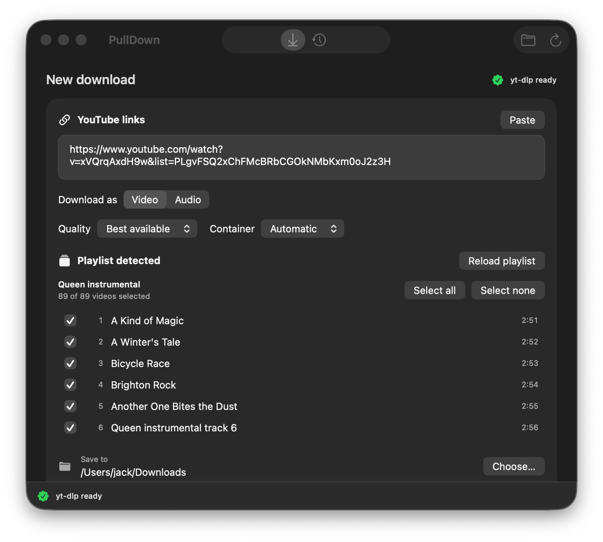

# PullDown

PullDown is a compact, fully native SwiftUI front end for `yt-dlp`. It downloads YouTube video or audio without requiring Terminal, and includes an optional menu-bar companion.



## What works

- Finds `yt-dlp` in standard macOS, Homebrew, MacPorts and Python installation paths, or installs a checksum-verified official build.
- Cleans shared links and removes tracking, timestamp and fragment parameters before downloading.
- Loads complete playlists, with Select all, Select none and individual video selection.
- Offers video quality and container controls, audio format and bitrate controls, metadata, thumbnails, subtitles and filename templates.
- Saves to Downloads by default or another folder chosen with the native macOS picker.
- Shows download progress and ETA while data is transferring, then a clear finalising state.
- Keeps a persistent download history with Finder actions, source-link copying, retrying and safe history clearing.
- Provides the same core download controls from an optional menu-bar item, which can be disabled in Settings.
- Includes the supplied Icon Composer artwork, with Liquid Glass rendering on macOS 26 and newer and a generated compatibility rendition on macOS 15.
- Uses Liquid Glass on macOS 26 and newer, with native macOS materials on macOS 15.
- Supports Command-1 for New Download, Command-2 for Activity and Command-Return to start with the current settings.

PullDown is built with SwiftUI, AppKit integration and Foundation. It does not embed a browser or web interface, and it invokes `yt-dlp` directly without a shell.

## Requirements

- macOS 15 or later
- `yt-dlp`, installed automatically if required
- FFmpeg for audio conversion and merging separate high-quality video and audio streams
- Xcode 26 or later and Swift 6.2 or later when building from source

## Install

Download the appropriate ZIP from the [latest GitHub Release](https://github.com/j4ckxyz/PullDown/releases/latest): Apple Silicon for M-series Macs, or Intel for 64-bit Intel Macs. Unzip it, move PullDown to Applications and open it. The automatic builds are ad-hoc signed rather than notarised, so on first launch you may need to Control-click the app, choose Open and confirm.

To build from source instead, clone the repository with:

```sh
gh repo clone j4ckxyz/PullDown
```

Open `PullDown.xcodeproj` in Xcode, choose the PullDown scheme, then Run. PullDown is not sandboxed because it must discover package-manager executables and run `yt-dlp` outside the app container.

Every push to `main` builds separate Apple Silicon and Intel applications on the matching GitHub-hosted Mac runner, then publishes them with SHA-256 checksums in a new GitHub Release.

## URL handling

Shared links such as `https://youtu.be/8CENhRZmRBc?si=…` are reduced to the video URL. Playlist identifiers are retained, while tracking and start-time parameters such as `&t=182s` are removed.

## Tests

Run the Swift Testing suite with:

```sh
swift test
```

The tests cover the supplied shared link, playlist link and timestamp link, full playlist metadata parsing and selection, command construction, executable discovery, installation verification, progress parsing and a mocked end-to-end download.
